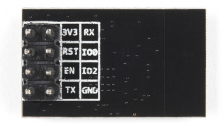

# ESP8266_AT_Command_Driver

English |[中文](README_zh.md)

This is  ESP8266 AT command driver for **stm32f103RET6** platform (also runs at stm32f103c8t6 platform), which gives full process function of the AT command. 

(version: 1.0.0) 

It can provide software support driver for esp8266 UART full module(such as [WiFi Module - ESP8266 (4MB Flash)](https://www.sparkfun.com/products/17146)).  

- The ESP system AT commands can  be seen at [https://github.com/espressif/esp-at](https://github.com/espressif/esp-at)

-  command list for ESP8266 can be seen at [ESP-AT User Guide &mdash; ESP-AT User Guide documentation](https://docs.espressif.com/projects/esp-at/en/release-v2.2.0.0_esp8266/index.html)

- provide several Basic AT Commands, several  Wi-Fi AT Commands and TCP-IP AT Commands. 


## Introduction:

1. this is an AT command string driver fully written in C for maximum portability (also portable for ESP32, ESP32-C2, ESP32-C3, ESP32-C6 and ESP32-S2)  

2. the  message is transferred & received by USART, the hardware transfer function are given in `esp8266_driver.c` and `esp8266_driver.h`

3.  you can easily add other AT command that not provided into this project. just write it in `example_code.c` and then move it to `esp8266_command_func.c` 


file structure of this library is listed as follows: 
master 
├─Delay_func (only provide delay functions, you can change it to your delay function) 
|    - Delay.h
|    - Delay.c
└─ESP8266
     - esp8266_driver.h  
     - esp8266_driver.c
     - esp8266_command_func.c

     - esp8266_command_func.h

example_code.c 


## Hardware Information

Pin of the ESP8266 module is shown at this image: 



this driver use USART3 as the transfer USART, so the default pin  layout is (define it in `esp8266_driver.h`, if you change this, don't forget change init functions and interrupt function): 

- RX - PB10

- TX - PB 11 

- **EN - VCC (don't use PB6 or you should add delay after GPIO initialize)**

- RST - PB7 

- IO0 - PB0(can be leave as float) 

- IO1 - PB1(can be leave as float)


## Command Receiver Structure


## Usage

in the main  function, include this library just use :  

```c
#include "esp8266_driver.h" // this provide the basic esp8266 USART driver

#include "esp8266_command_func.h" // this provide AT command
```

and remember to call  this function before call any  other functions :   

```c
Delay_ms(1000); // if you just power on the module, wait 1s for module init 
esp8266_Init();
```

the esp8266 functions are provide with prefix `esp8266_`  

and esp8266 command functions have following command prefix: 

`esp8266_cmd_`  :  Basic AT Commands 

`esp8266_cmd_wifi_` : Wi-Fi AT Commands 

`esp8266_cmd_tcp_` : TCP-IP AT Commands

if a property has both "query(?)" and "setting(=)" method, it will have `get` or `set` in the function name. 
